<!-- more -->

## 概述
vue的两大特性是响应式编程和组件化。组件（Component）是 Vue 最核心的功能，但是各个组件实例的作用域是相互独立的，这表明不同组件之间的数据是无法直接相互引用的。如果想要跨组件引用数据，就需要用到组件通信了，在通信之前先要理解组件之间的关系：

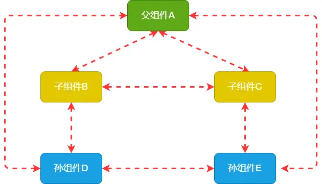

如上图所示：
父子关系：A与B，A与C，B与D，C与E
兄弟关系：B与C
隔代关系（可能隔更多代）：A与D，A与E
跨级关系：B与E，D与E等
## 通信方式
### 一、<code>props</code>/<code>$emit</code>


父组件通过<code>v-bind</code>绑定一个自定义的属性，子组件通过<code>props</code>接收父组件传来的数据；子组件通过<code>$emit</code>触发事件，父组件用<code>on()</code>或者在子组件的自定义标签上使用<code>v-on</code>来监听子组件触发的自定义事件，从而接收子组件传来的数据。
#### 1、父组件向子组件传值

下面通过一个例子来说明父组件向子组件传值，父组件parent.vue把数据<code>books:['JavaScript高级程序设计', 'CSS新世界', '图解 HTTP 彩色版']</code>传给子组件child.vue，并在child.vue中展示出来

```js
// 父组件parent.vue
<template>
  <div>
    <Child :books="books"/>
  </div>
</template>

<script>
import Child from './components/Child.vue'

export default {
  name: 'parent',
  components: {
    Child
  },
  data() {
    return {
      books: ['JavaScript高级程序设计', 'CSS新世界', '图解 HTTP 彩色版']
    }
  }
}
</script>
```

```js
// 子组件child.vue
<template>
  <div>
    <ul>
      <li v-for="(item, index) in books" :key="index">{{item}}</li>
    </ul>
  </div>
</template>

<script>
export default {
  props: {
    books: {
      type: Array,
      default: () => {
        return []
      }
    }
  }
}
</script>
```
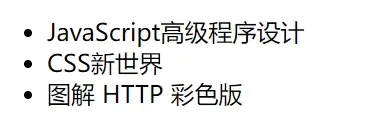
注意：通过props传递数据是单向的，父组件数据变化时会传递给子组件，但子组件不能通过修改props传过来的数据来修改父组件的相应状态，即所谓的单向数据流。 
### 2、子组件向父组件传值
下面通过子组件点击书籍列表，用<code>$emit()</code>触发，然后再父组件中获取

```js
// 子组件child.vue
<template>
  <div>
    <ul>
      <li v-for="(item, index) in books" :key="index" @click="like(item)">{{item}}</li>
    </ul>
  </div>
</template>

<script>
export default {
  props: {
    books: {
      type: Array,
      default: () => {
        return []
      }
    }
  },
  methods: {
    like(item) {
      this.$emit('likeBook', item)
    }
  }
}
</script>

```

```js
// 父组件parent.vue
<template>
  <div>
    <Child :books="books" @likeBook="likeBook"/>
  </div>
</template>

<script>
import Child from './components/Child.vue'

export default {
  name: 'parent',
  components: {
    Child
  },
  data() {
    return {
      books: ['JavaScript高级程序设计', 'CSS新世界', '图解 HTTP 彩色版']
    }
  },
  methods: {
    likeBook(val) {
      alert('我最喜欢的书籍是《' + val + '》')
    }
  }
}
</script>

```
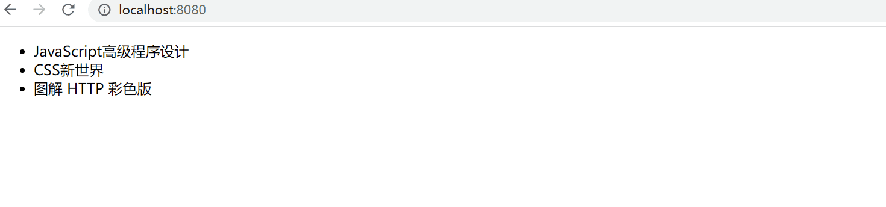
### 二、<code>\$parent</code>/<code>$children</code>
* $parent：访问父组件实例
* $children：访问子组件实例

```js
// 父组件parent.vue
<template>
  <div>
    <Child />
    <button @click="getChildData">获取子组件数据</button>
  </div>
</template>

<script>
import Child from './components/Child.vue'

export default {
  name: 'parent',
  components: {
    Child
  },
  data() {
    return {
      books: ['JavaScript高级程序设计', 'CSS新世界', '图解 HTTP 彩色版']
    }
  },
  methods: {
    getChildData() {
      alert(this.$children[0].msg)
    }
  }
}
</script>

```

```js
// 子组件child.vue
<template>
  <div>
    <ul>
      <li v-for="(item, index) in bookLists" :key="index">{{item}}</li>
    </ul>
  </div>
</template>

<script>
export default {
  name: 'child',
  data() {
    return {
      bookLists: [],
      msg: '我是子组件的值！'
    }
  },
  mounted() {
    this.bookLists = this.$parent.books
  }
}
</script>

```
注意：<code>\$parent</code>拿到的是对象，如果是最顶层没有父组件的情况下拿到的是<code>undefined</code>；<code>$children</code>拿到的是数组，如果是做底层没有子组件的情况下，拿到的是空数组;这两种通信方式只能用于父子组件通信
### 三、<code>ref</code>
ref如果在普通Dom元素上使用，引用指向的就是 DOM 元素；如果在子组件上使用，引用就指向组件实例，可以通过实例直接调用组件的方法和数据

```js
// 父组件parent.vue
<template>
  <div>
    <Child ref="child" />
    <button @click="getChildData">获取子组件数据</button>
  </div>
</template>

<script>
import Child from './components/Child.vue'

export default {
  name: 'parent',
  components: {
    Child
  },
  methods: {
    getChildData() {
      const msg = this.$refs['child'].msg
      console.log(msg)
      this.$refs['child'].say()
    }
  }
}
</script>

```

```js
// 子组件child.vue
<script>
export default {
  name: 'child',
  data() {
    return {
      msg: '我是子组件的值！'
    }
  },
  methods: {
    say() {
      alert('你好，我是子组件！')
    }
  },
}
</script>
```
### 四、<code>provide</code>/<code>inject</code>
祖先组件通过<code>provide</code>来提供变量，子孙组件通过<code>inject</code>注入变量来获取祖先组件的数据，不管子孙组件嵌套有多深, 只要调用了inject 那么就可以注入provide中的数据。下面是具体代码：

```js
// 父组件
<template>
  <div>
    <h1>康熙</h1>
    <Son />
  </div>
</template>

<script>
import Son from './components/Son.vue'

export default {
  components: {
    Son
  },
  provide() {
    return {
      FatherToSon: this.FatherToSon,
      FatherToGrandson: this.FatherToGrandson,
    }
  },
  data() {
    return {
      FatherToSon: '我是康熙，雍正，你是我儿子！',
      FatherToGrandson: '我是康熙，乾隆，你是我孙子！',
    }
  }
}
</script>

```

```js
// 子组件
<template>
  <div>
    <h1>雍正</h1>
    <button @click="receive">接收</button>
    <Grandson />
  </div>
</template>

<script>
import Grandson from './Grandson.vue'
export default {
  components: { 
    Grandson 
  },
  inject: ['FatherToSon'],
  methods: {
    receive() {
      alert(this.FatherToSon)
    }
  }
}
</script>

```

```js
// 孙组件
<template>
  <div>
    <h1>乾隆</h1>
    <button @click="receive">接收</button>
  </div>
</template>

<script>
export default {
  inject: ['FatherToGrandson'],
  methods: {
    receive() {
      alert(this.FatherToGrandson)
    }
  }
}
</script>

```
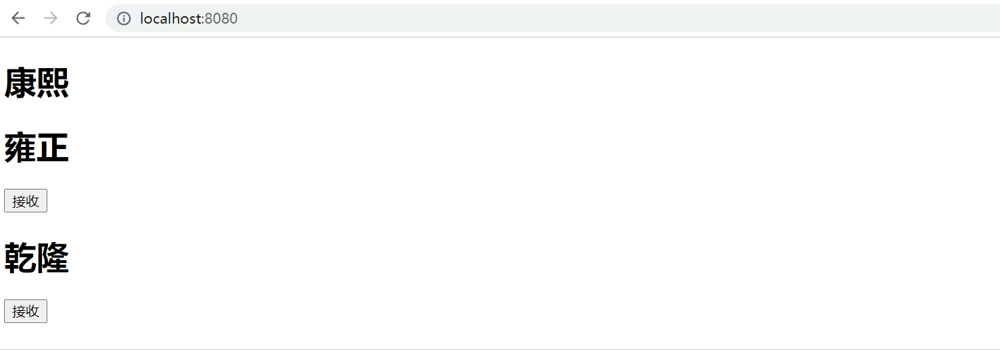
注意：provide/inject只能从上往下传值，且不是响应式，若要变成响应式的数据provide需要提供函数
### 五、<code>eventBus</code>的<code>\$emit</code>/<code>$on</code>
eventBus是消息传递的一种方式，基于一个消息中心，订阅和发布消息的模式，称为发布订阅者模式。
eventBus 又称为事件总线。在 Vue 中可使用 eventBus 来作为沟通桥梁的概念，就像是所有组件共用相同的事件中心，可向该中心注册发送事件或接收事件，所以组件都可以上下平行地通知其他组件。
* <code>$emit('name',args)</code>: name:发布的消息名称 ， args：发布的消息
* <code>$on('name',fn)</code>: name:订阅的消息名称， fn: 订阅的消息
* <code>\$once('name',fn)</code>: name:订阅的消息名称， fn: 订阅的消息。与$on相似但是只触发一次，一旦触发之后，监听器就会被移除
* <code>\$off('name',callback)</code>:name:事件名称，callback:回调监听器
eventbus可以实现任何组件之前的通信，下面以兄弟组件为例
#### 1、初始化，全局引入

```js
// main.js
// 全局添加事件总线
Vue.prototype.$bus = new Vue()
```
#### 2、发送事件
在parent.vue引入ChildA和ChildB组件，使它们成为兄弟组件

```js
// 父组件parent.vue
<template>
  <div>
    <ChildA />
    <ChildB />
  </div>
</template>

<script>
import ChildA from './components/childA'
import ChildB from './components/childB'
export default {
  components: {
    ChildA,
    ChildB
  }
}
</script>

```
在ChildA组件中用<code>$emit</code>发送事件
```js
// ChildA组件
<template>
  <div>
    <h1>组件A</h1>
    <button @click="send">发送</button>
  </div>
</template>

<script>
export default {
  methods: {
    // 发送事件
    send() {
      this.$bus.$emit('message', '欢迎使用eventBus!')
    }
  }
}
</script>

```
#### 3、接收事件发送的事件
在ChildB组件中用<code>$on</code>接收ChildA发送的事件

```js
// ChildB组件
<template>
  <div>
    <h1>组件B</h1>
  </div>
</template>

<script>
export default {
  mounted() {
    // 接收事件
    this.$bus.$on('message', data => {
      alert('我是组件B，我收到的消息为：' + data)
    })
  },
  beforeDestroy() {
    this.$bus.$off('message')
  }
}
</script>

```
注意：<code>\$on</code>监听的事件不会自动移除监听，因此在不用时最好使用<code>$off</code>移除监听以免产生问题
### 六、<code>\$attrs</code>/<code>$listeners</code>
#### 1、简介
当组件为两级嵌套时，一般采用<code>props</code>和<code>\$emit</code>，但遇到多级组件嵌套时这种方法就不太适用了，如果不做中间处理，只传递数据用vuex有点大材小用了。因此在<code>vue2.4</code>中为了解决这一需求，便引入了<code>\$attrs</code>和<code>$listeners</code>， 新增了<code>inheritAttrs</code>属性
* <code>\$attrs</code>：当父组件传递了很多数据给子组件时，子组件没有声明props来进行接收，么子组件中的attrs属性就包含了所有父组件传来的数据(除开已经props声明了的)；子组件还可以使用<code>v−bind="$attrs"</code>的形式将所有父组件传来的数据(除开已经props声明了的)传向下一级子组件,通常和<code>interitAttrs</code>属性一起使用。
* <code>\$listeners</code>：包含了父组件中(不含<code>.native</code>修饰器的)v-on 事件监听器，通过<code>v-on="$listeners"</code>，可以将这些事件绑定给它自己的子组件
#### 2、实例
下面看一个例子：

```js
// 父组件
<template>
  <div>
    <ChildA :name="name" :sex="sex" :age="age" @getName="getName" @getAge="getAge" />
  </div>
</template>

<script>
import ChildA from './components/childA'
export default {
  name: 'parent',
  components: {
    ChildA,
  },
  data() {
    return {
      name: '小明',
      age: 18,
      sex: '男'
    }
  },
  methods: {
    // 获取名字
    getName() {
      console.log('我的名字是' + this.name)
    },
    // 获取年龄
    getAge() {
      console.log('我今年' + this.age + '岁');
    }
  }
}
</script>

```

```js
// 子组件A
<template>
  <div>
    <h1>组件A</h1>
    {{ msgA }}
    <hr/>
    <ChildB v-bind="$attrs" :height="height" v-on="$listeners" @getHeight="getHeight" />
  </div>
</template>

<script>
import ChildB from './childB.vue'
export default {
  name: 'ChildA',
  components: {
    ChildB
  },
  data() {
    return {
      msgA: null,
      height: '175cm'
    }
  },
  props: {
    sex: {
      type: String,
      default: ''
    }
  },
  mounted() {
    this.msgA = this.$attrs
    console.log('组件A获取的$listeners:', this.$listeners)
  },
  methods: {
    // 获取身高
    getHeight() {
      console.log('我的身高是' + this.height);
    }
  }
}
</script>

```

```js
// 孙组件B
<template>
  <div>
    <h1>组件B</h1>
    {{ msgB }}
  </div>
</template>

<script>
export default {
  name: 'ChildB',
  data() {
    return {
      msgB: null
    }
  },
  mounted() {
    this.msgB = this.$attrs
    console.log('组件B获取的$listeners:', this.$listeners)
  }
}
</script>

```
$attrs获取的结果：
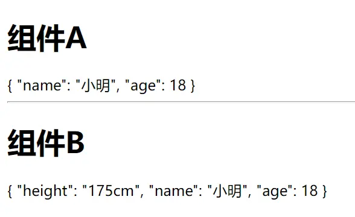

$listeners获取的结果：
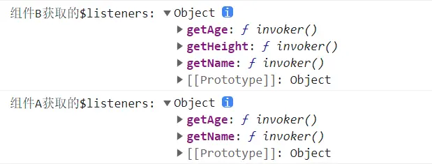

如代码和图所示组件A中<code>props</code>声明接收了sex属性，因此组件中<code>\$attrs</code>获取的是父组件中绑定的除去sex属性的值；组件A中使用了<code>v-bind="\$attrs"</code>和<code>v-on="$listeners"</code>，则组件B获取不仅是组件A中本身绑定的属性和方法还包含组件A获取父组件绑定的属性和方法
#### 3、inheritAttrs
如果父组件传递了很多参数给子组件，而子组件没有用props完全接收，那么没有接收的这些属性作为普通的 HTML <code>attribute </code>应用在子组件的根元素上
如果你不希望子组件的根元素继承特性，你可以在组件的选项中设置<code>inheritAttrs: false</code>

以上面的组件B为例，当inheritAttrs为true（inheritAttrs默认为true）
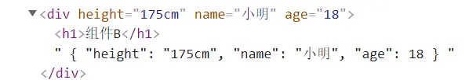

当inheritAttrs为false时

```js
// 孙组件B
export default {
  name: 'ChildB',
  inheritAttrs: false,
  data() {
    return {
      msgB: null
    }
  },
  mounted() {
    this.msgB = this.$attrs
    console.log('组件B获取的$listeners:', this.$listeners)
  }
}
```
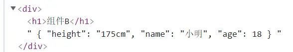
### 七、<code>Vuex</code>
#### 1、Vuex概述
Vuex 是一个专为 Vue.js 应用程序开发的**状态管理模式 + 库**。它采用集中式存储管理应用的所有组件的状态，并以相应的规则保证状态以一种可预测的方式发生变化。
状态管理包含以下几个部分：
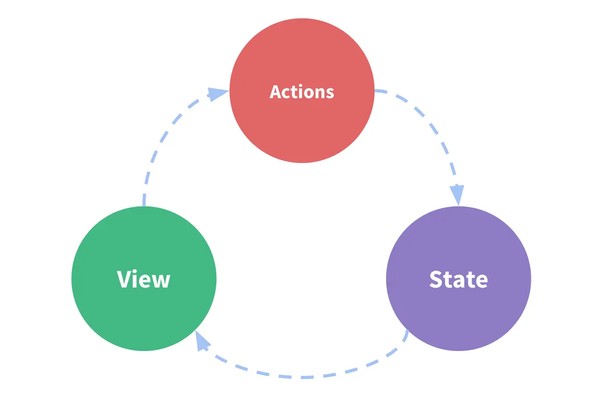
* **状态（State）**，驱动应用的数据源
* **视图（View）**，以声明方式将**状态**映射到视图；
* **操作（Actions）**，响应在**视图**上的用户输入导致的状态变化

视图发生变化会导致数据源的改变，数据源发生变化则会改变视图，则上面表示是一个“单向数据流”。但是当我们的应用遇到多个组件共享状态时，单向数据流的简洁性很容易被破坏：
* 多个视图依赖于同一状态。
* 来自不同视图的行为需要变更同一状态。

因此，为了解决这种问题我们把组件的共享状态抽取出来，以一个全局单例模式管理。在这种模式下，我们的组件树构成了一个巨大的“视图”，不管在树的哪个位置，任何组件都能获取状态或者触发行为！

通过定义和隔离状态管理中的各种概念并通过强制规则维持视图和状态间的独立性，我们的代码将会变得更结构化且易维护。
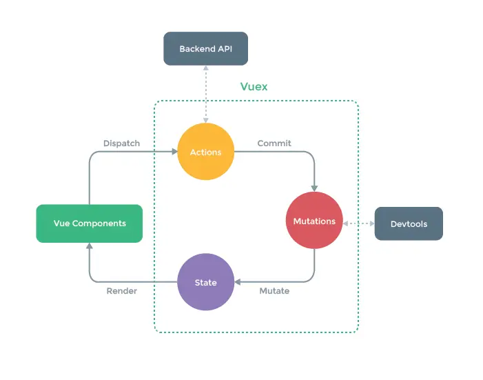
### 2、 Vuex各个模块
1、<code>state</code>：存储应用中需要共享的状态，是**Vuex**中的唯一数据源。
2、<code>getters</code>:类似Vue中的计算属性<code>computed</code>，**getter** 的返回值会根据它的依赖被缓存起  来，且只有当它的依赖值发生了改变才会被重新计算。
3、<code>mutations</code>:更改 Vuex 的 store 中的状态(state)的唯一方法，且mutation 必须是同步函数
4、<code>actions</code>：类似于 mutation，提交的是 mutation，而不是直接变更状态；可以包含任意异步操作
5、<code>modules</code>：将 store 分割成模块（module）。每个模块拥有自己的 state、mutation、action、getter、甚至是嵌套子模块——从上至下进行同样方式的分割
### 3、Vuex举例

```js
// 父组件
<template>
  <div class="home">
    <h1>父组件</h1>
    <hr/>
    <ChildA />
    <hr/>
    <ChildB />
  </div>
</template>

<script>
import ChildA from './components/ChildA'
import ChildB from './components/ChildB'

export default {
  name: 'parent',
  components: {
    ChildA,
    ChildB
  }
}
</script>

```

```js
// 子组件A
<template>
  <div>
    <h1>组件A</h1>
    <p>A获取的值: {{ count }}</p>
    <button @click="add(5)">ChildA-add</button>
  </div>
</template>

<script>
export default {
  computed: {
    count() {
      return this.$store.state.count
    }
  },
  methods: {
    // 改变store里count的值
    add(num) {
      this.$store.dispatch('countAdd', num)
    }
  }
}
</script>

<style>

</style>
```

```js
// 子组件B
<template>
  <div>
    <h1>组件B</h1>
    <p>B获取的值: {{ countB }}</p>
    <button @click="add(10)">ChildB-add</button>
  </div>
</template>

<script>
import { mapMutations, mapGetters } from 'vuex'
export default {
  computed: {
    ...mapGetters({
      countB: 'getCount'
    })
  },
  methods: {
    ...mapMutations(['countAdd']),
    // 改变store里count的值
    add(num) {
      this.countAdd(num)
    }
  }
}
</script>

<style>

</style>
```
store.js

```js
import Vue from 'vue'
import Vuex from 'vuex'

Vue.use(Vuex)

export default new Vuex.Store({
  state: {
    count: 0,
  },
  getters: {
    getCount: (state) => {
      return state.count
    }
  },
  mutations: {
    countAdd(state, num) {
      state.count += num
    }
  },
  actions: {
    countAdd(context, num) {
      context.commit('countAdd', num)
    }
  },
  modules: {
  }
})

```
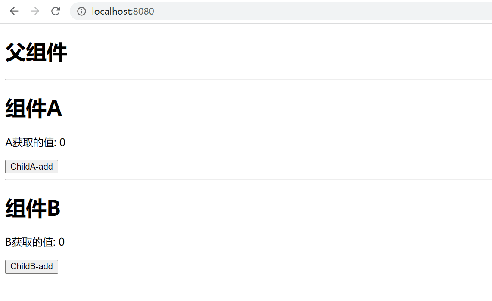
### 八、<code>localStorage</code>/<code>sessionStorage</code>
#### 1、介绍
**localStorage**：本地存储对象，存储的数据是永久性数据,页面刷新，即使浏览器重启，除非主动删除不然存储的数据会一直存在
**sessionStorage**：与localStorage相似，但是只有在当前页面下有效，关闭页面或浏览器存储的数据将会清空

 localStorage和sessionStorage常用的API：
    setItem (key, value) ——  保存数据，以键值对的方式储存信息。
    getItem (key) ——  获取数据，将键值传入，即可获取到对应的value值。
    removeItem (key) ——  删除单个数据，根据键值移除对应的信息。
    clear () ——  删除所有的数据
    key (index) —— 获取某个索引的key
#### 2、举例

```js
// 存储
setItem() {
  window.localStorage.setItem('name1', '小明')
  window.sessionStorage.setItem('name2', '小红')
}
```

```js
// 接收
receive() {
  const name1 = window.localStorage.getItem('name1')
  const name2 = window.sessionStorage.getItem('name2')
  console.log(name1) // 打印结果为：小明
  console.log(name2) // 打印结果为：小红
}
```
#### 3、setItem()和getItem()使用时的类型转换
localStorage和sessionStorage通过<code>setItem()</code>存储数据会自动转换为<code>String</code>类型，但是通过<code>getItem()</code>其类型并不会转换回来（localStorage和sessionStorage使用方法一样，下面均以localStorage为例）

```js
const num = 1
window.localStorage.setItem('num', num)

const numRec = window.localStorage.getItem('num')
console.log(numRec, typeof(numRec)) // 1 string
```
因此正确的存储方式应该为：存储之前用<code>JSON.stringify()</code>方法将数据转换成json<code>字符串</code>形式；需要使用数据的时候用<code>JSON.parse()</code>方法将之前存储的字符串转换成json对象

```js
const num = 1
window.localStorage.setItem('num', JSON.stringify(num))
const obj = {
   name: '小红',
   age: 18
 }
window.localStorage.setItem('obj', JSON.stringify(obj))

const numRec = JSON.parse(window.localStorage.getItem('num'))
console.log(numRec, typeof(numRec)) // 1 'number'
const objRec = JSON.parse(window.localStorage.getItem('obj'))
console.log(objRec, typeof(objRec)) // {name: '小红', age: 18} 'object'
```
**注意**：localStorage.setItem()和sessionStorage.setItem()不能直接存储对象，必须使用<code>JSON.stringify()</code>和<code>JSON.parse()</code>转换实现
## 总结
以上8种通信方式主要应用在以下三类场景：
* **父子组件通信：**最经常使用通信方式的是<code>props</code>/<code>\$emit</code>，单一的父子组件通信使用<code>\$parent></code>/<code>\$children</code>也比较方便；父组件也常使用<code>ref</code>获取子组件实例；也可使用<code>provide</code>/<code>inject</code>、<code>\$attrs</code>/<code>\$listeners</code>以及<code>localStorage</code>/<code>sessionStorage</code>
* **兄弟组件通信：**简单的数据传递可使用<code>eventBus</code>的<code>\$emit</code>/<code>\$on</code>；复杂的数据使用<code>Vuex</code>比较方便;也可以使用<code>localStorage</code>/<code>sessionStorage</code>;
* **跨级组件通信：**父子孙等嵌套组件通信方式多使用<code>provide</code>/<code>inject</code>和<code>\$attrs</code>/<code>\$listeners</code>；跨级组件通信的数据如果不复杂可使用<code>eventBus</code>和<code>localStorage</code>/<code>sessionStorage</code>；如果数据复杂可使用<code>Vuex</code>，但是要注意刷新界面Vuex存储的数据会消失

## 结尾
本篇文章只是简单记录了一下平时使用的组件通信方式，并没有深入的介绍其细节，如果有错误的地方欢迎指正